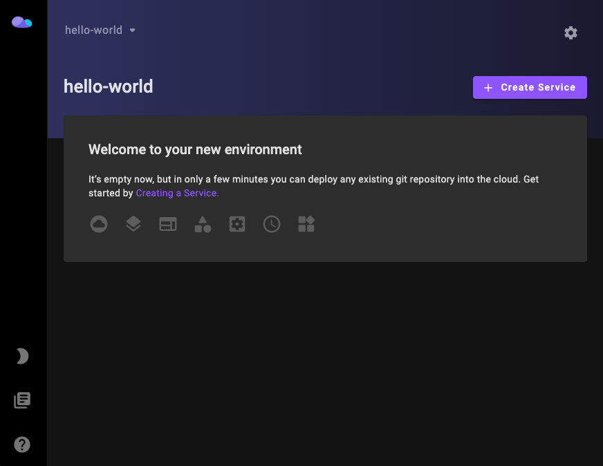

# Kinto Dashboard
[](https://slack.kintohub.com)

Kinto Dashboard is a general purpose, web-based UI for managing your [Kinto Core](../core). It allows you to manage your applications deployed by Kinto Core with ease.



## Getting Started

See documentation in our [website](https://www.kintohub.com/getting-started/introduction).

### Prerequisite

Make sure you have a Kubernetes cluster and a [Kinto Core](../core) is running on it.

### Running Locally

[comment]: <> (add helm chart/docker image for direct deploy?)

If you have direct access to the Kubernetes cluster and Kinto Core, then you can run Kinto Dashboard locally with connecting to the port-forwarded Kinto Core:

```bash
# port-forward your kinto-core
kubectl port-forward -n kintohub kinto-core 8080:8080 

# create the environment variable REACT_APP_SERVER_URL and point it to kinto-core
echo "REACT_APP_SERVER_URL=http://localhost:8080" > .env

# install dependencies
yarn 

# start with default 3000 port
yarn start
```

### Install via Kubernetes (yaml)

You can also install Kinto Dashboard into Kubernetes directly. But we strongly advise not to expose the Kinto Dashboard to public as it could expose some admin actions that may harmful to your cluster.

## Development

### Project Structure

```text
|
|- .story
|- build   # build folder for the website 
|- config  # config files for building, including the webpack config
|- refs    # git submodules for kinto-core
|- public  # static files
|- scripts # start up scripts. including the envVar replacement script
|- src     # src folder
    |- __tests__  # jest tests
    |- assets     # assets for react app  
    |- components # React components
    |- libraries  # logic and helper classes
    |- routes     # routers
    |- state      # redux states/actions/reducers
    |- stories    # storybook files
    |- theme      # MUI theme and colors
    |- types      # typescript types
       
```

### Generating Types From Proto Files

The `.proto` files of this project is referencing from `kinto-core`. 
In normal case the `main` branch already contains the latest codes generated from `.proto` files. 
However, if you want to use the proto files other than `main` from `kinto-core` (for example some alpha features) 
you should checkout the corresponding branch for the git submodule (the `refs` folder) and generate the codes from them.

```bash

cd refs/kinto-core

git checkout dev

cd ../..

# generate the type files from protos
./protogen.sh

```

### Storybook

Storybook provides a way to test the component easily. We use Storybook to test some atoms/molecules especially those are on SidePanel or Popups.

```bash
yarn storybook

# visit localhost:9009
```

### Environment Variables

```bash

# first add the environment variables here 
./src/libraries/envVars.ts

# second update the script to make sure the env vars get replaced at run time
./scripts/replaceEnvVars.sh
```
